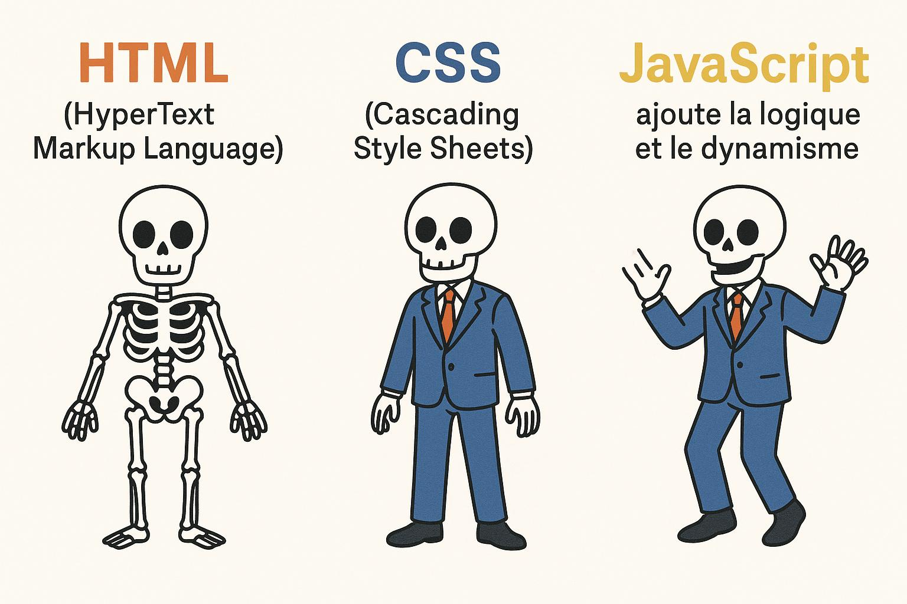

# Session 1 - Introduction et fondement algorithmique

>**Durée** : 3h30 (avec pause)
>
>**Objectif** : découvrir HTML, CSS et JavaScript à travers un mini-projet : allumer et éteindre une ampoule.

## 1. Qu'est-ce que le développement frontend ?

Le **frontend** est la partie d'un site web que l'on voit et que l'on utilise.
C'est :

* l'**interface visuelle** (textes, images, boutons, formulaires),
* l'**ergonomie** (organisation, facilité d'utilisation),
* l'**interactivité** (réactions aux actions de l'utilisateur).

À l'inverse, le **backend** gère ce que l'on ne voit pas : la logique métier, les bases de données, l'authentification, etc.

**Exemple concret** :

* Sur un site de commerce, le frontend affiche les produits et permet d'ajouter au panier.
* Le backend enregistre les commandes et gère les paiements.

Très bonne idée : on peut présenter chaque langage sous deux angles — celui du développeur (fonction technique) et celui du linguiste (ce que dit la « langue » elle-même). Voici une version étoffée en ce sens :

--- 
## 2. Les trois langages du web

Un site web repose toujours sur trois technologies principales : **HTML**, **CSS** et **JavaScript**. Elles ne sont pas interchangeables, chacune a son rôle propre.





### **HTML** 
>*HyperText Markup Language*

**Point de vue développeur** : le HTML sert à construire la structure et le contenu de la page. Il permet de placer un titre, un paragraphe, une image, un tableau ou un formulaire. C'est la base sur laquelle tout le reste s'appuie.

**Point de vue linguistique** : HTML est un langage déclaratif. On ne donne pas d'ordres, on déclare. Ecrire `<h1>Bienvenue</h1>` revient à affirmer « ceci est un titre principal » plutôt qu'à demander « affiche ceci en grand ». 

**HTML fonctionne donc comme une grammaire qui définit la place et la fonction de chaque élément dans le document**

_Would you like to know more ?_ :
- Documentation fiable : [MDN – Guide HTML (Mozilla)](https://developer.mozilla.org/fr/docs/Web/HTML), [HTML Living Standard (WHATWG)](https://html.spec.whatwg.org/multipage/)
- Guides pédagogiques :   [Web.dev – Cours structuré, moderne, simple](https://web.dev/learn/html/), [Liste des balises HTML avec explications visuelles](https://htmlreference.io/)
- Jeu: [CSS Diner, utile pour comprendre les sélecteurs et la structure](https://flukeout.github.io/)

### **CSS** 
>*Cascading Style Sheets*

**Point de vue développeur** : le CSS contrôle l'apparence et la mise en forme. Couleurs, polices, tailles, marges, alignements, tout ce qui touche à l'esthétique et à l'ergonomie passe par lui. Sans CSS, une page reste brute et difficile à parcourir.

**Point de vue linguistique** : CSS est un langage descriptif qui fonctionne par règles et sélecteurs. Chaque règle s'applique comme un accord de style : on dit « tous les titres de niveau 1 seront rouges » (`h1 { color: red; }`). 

**C'est une langue de conventions, qui hiérarchise les priorités (la cascade)**

_Would you like to know more ?_ :
- Documentation fiable : [MDN – Guide CSS](https://developer.mozilla.org/fr/docs/Web/CSS)
- Guides pédagogiques :   [Web.dev – Cours gratuit et structuré sur le CSS moderne](https://web.dev/learn/css/), [CSS Tricks – Guides et astuces](https://css-tricks.com/guides/), [Reference complète des propriétés CSS](https://cssreference.io/)
- Jeux Flexbox et Grid : [Flexbox Froggy](https://flexboxfroggy.com/#fr), [Grid Garden](https://cssgridgarden.com/#fr)

### **JavaScript** 
>*ECMAScript*

**Point de vue développeur** : JavaScript apporte la logique et l'interactivité. Il permet de réagir aux actions de l'utilisateur, de modifier le contenu à la volée, de communiquer avec un serveur, bref de transformer une page statique en application dynamique.

**Point de vue linguistique** : JavaScript est un langage impératif. Contrairement au HTML qui déclare, et au CSS qui décrit, JavaScript commande. Quand on écrit `alert("Bonjour");`, on donne un ordre précis : « affiche une alerte ». 

**C'est une langue d'actions, avec une grammaire proche des langages humains qui utilisent les verbes pour exprimer des comportements**

_Would you like to know more ?_ :
- Documentation fiable : [MDN – Guide JavaScript](https://developer.mozilla.org/fr/docs/Web/JavaScript)
- Guides pédagogiques : [JavaScript.info – Le cours JS le plus clair du web](https://fr.javascript.info/)
- Challenge : [Exercices progressifs JavaScript DOM](https://www.freecodecamp.org/learn/javascript-algorithms-and-data-structures/), [JS30 (30 projets JS sans frameworks)](https://javascript30.com/)


### À retenir

* Sans **HTML**, il n'y a rien à afficher.
* Sans **CSS**, la page existe mais elle est brute, sans esthétique ni hiérarchie visuelle claire.
* Sans **JavaScript**, la page est statique, elle ne répond pas activement aux actions de l'utilisateur.

C'est la combinaison de ces trois langages qui permet de créer des sites modernes, accessibles et interactifs.

```html
<!DOCTYPE html>
<html lang="en">
<head>
  <meta charset="UTF-8">
  <title>Triad Example</title>
  <style>
    /* CSS = style */
    h1 {
      color: darkblue;
      font-family: sans-serif;
    }
  </style>
</head>
<body>
  <!-- HTML = structure -->
  <h1>Hello, World!</h1>
  <button id="btn">Click me</button>

  <script>
    // JavaScript = logic/dynamism
    document.getElementById("btn").addEventListener("click", (e) => {
      alert("Button clicked!");
    };
  </script>
</body>
</html>
```

Ce snippet montre comment chaque langage du frontend joue un rôle séparé dans une même page. 

- Le **HTML** sert ici uniquement à placer les éléments : un titre et un bouton. Il décrit la structure de la page, c’est-à-dire *ce qui existe* et *où cela se trouve*, sans décider de l’apparence ni du comportement.
- Le **CSS**, intégré dans la zone dédiée, modifie l’apparence visuelle du titre. Il gère uniquement le style : couleurs, polices, espacements, mise en page. Rien de ce qu’il contient n’ajoute de contenu ou de logique, il ne fait qu’habiller les éléments déjà créés en HTML.
- Le **JavaScript**, placé en bas de la page, ajoute l’interactivité. Il réagit aux actions de l’utilisateur — ici, un clic sur le bouton — et déclenche un comportement. Son rôle est de rendre la page dynamique, sans toucher ni à la structure, ni au style.

> Remarquez que si l’exemple regroupe tout dans un seul fichier, il est fortement recommandé de séparer HTML, CSS et JavaScript dans **trois fichiers distincts**. Cela rend le projet plus clair, plus facile à maintenir, et respecte parfaitement le principe de séparation des responsabilités (SoC).

### ⚠️⚠️⚠️ À propos de `alert()`, `prompt()` et `confirm()` ⚠️⚠️⚠️

`alert()`, `prompt()` et `confirm()` sont des **abominations antiques**, des résidus toxiques issus d’une époque où le web ressemblait à un laboratoire clandestin géré par des ingénieurs sous amphétamines.
Les utiliser aujourd’hui revient à **balancer une sirène anti-émeute** dans la tête de votre utilisateur pour lui demander « Ça va ? ».

Ces fonctions bloquent tout : la page, la navigation, la respiration, la foi en l’humanité. Sur un lecteur d’écran, elles déclenchent une expérience mystique comparable à être enfermé dans un ascenseur avec un perroquet qui hurle son code PIN en boucle.
Bref : **ce ne sont pas des outils, ce sont des catastrophes naturelles encapsulées dans l’API du navigateur.**

Nous allons pourtant les utiliser, uniquement **pour montrer vite les rudiments des interaction en programmation, sans vous noyer dans de vrais composants HTML/CSS/Javascript**

**C’est la première et la dernière fois que vous employerez ces horreurs.**

Après ces séances, ces fonctions retourneront dans le sarcophage où elles auraient dû rester. Vous, vous apprendrez à faire des interactions modernes, accessibles et civilisées et pas des pop-ups de 1998.

---

## 3. Accessibilte (a11y)


### Description supplémentaire avec `aria-describedby`


```html
<button id="btn" aria-describedby="btn-info">
  Click this button
</button>
<p id="btn-info" class="visually-hidden">
  This button will display a confirmation message.
</p>
```

Le bouton possède maintenant une courte description lisible uniquement par les technologies d’assistance.
Le lecteur d’écran annoncera *“Click this button. This button will display a confirmation message.”*

---

### Taille du bouton accessible

```css
button {
  font-size: 1rem;
  padding: .5rem 1rem;
}
```
Clickabilité et lisibilité renforcées.

### Lisible mais invisible 

```css
.visually-hidden {
  position: absolute;
  clip: rect(1px, 1px, 1px, 1px);
  padding: 0;
  border: 0;
  height: 1px;
  width: 1px;
  overflow: hidden;
  white-space: nowrap;
}
```
C'est la méthode standard (WCAG) pour du texte lu par les lecteurs d’écran mais invisible.

### Activation du clavier

```javascript
document.getElementById("btn").addEventListener("keydown", (e) => {
  if (e.key === "Enter" || e.key === " ") {
    e.preventDefault(); // Space scroll sinon
    btn.click();
  }
});
```
---

## 4. Mise en pratique

[Exercices Session 01](./exercices/session_01.md)
