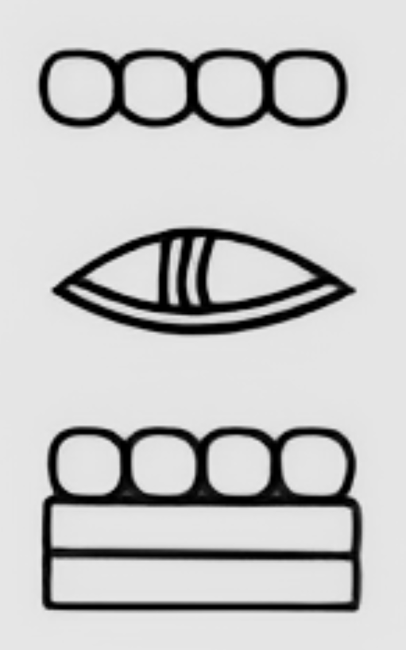
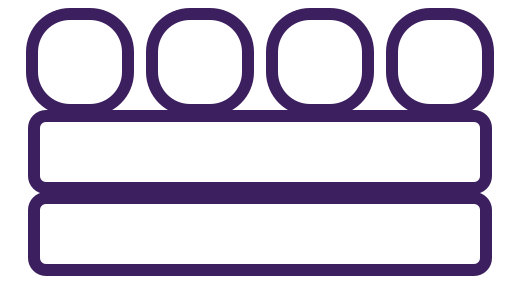

# Session +1

[Programme du module](./index.md)

## Sommaire

1. **Explorer une page apparemment vide** : retrouver le contenu dans le HTML, observer les règles CSS et rendre le texte visible.
2. **Du nom de couleur à RGB** : partir de `white`, `black` et `#000` pour découvrir trois quantités qui décrivent une couleur.
3. **Décomposer `255` en décimal** : lire la valeur d'un chiffre selon sa position et comprendre le rôle du zéro.
4. **Répondre en hexadécimal** : relier `255` à `FF`, puis les paires `RR`, `GG` et `BB` aux valeurs RGB.
5. **Représenter en binaire — prolongement** : retrouver la même valeur avec deux symboles, des bits et un octet.
6. **Monter jusqu'à la base 20** : lire une convention maya, puis en retrouver une trace dans le français.

**Interlude — 10 minutes**

7. **Du système sexagésimal à l'horloge** : démasquer une convention familière, puis construire un premier affichage.
8. **Faire avancer le temps** : distinguer calcul, affectation et affichage, puis rencontrer la limite des minutes.
9. **De la console aux fichiers** : conserver les instructions dans `clock.js`, chargé par `index.html`.
10. **Exprimer les règles avec `if`** : gérer les reports des minutes et des heures.

**Atelier individuel et fin du cours**

[Exercice +1](./exercices/session_01.md)


## 1. Une action visible, une valeur invisible

### Une page apparemment vide

<a href="./exercices/session_01/let-there-be-light.html" target="_blank" rel="noopener noreferrer">Ouvrez le document HTML dans un nouvel onglet, en vue scindée</a>. La page paraît vide : vous ne voyez qu'une surface noire. Cela suffit-il à conclure qu'elle ne contient rien ?


Cliquez sur la page et appliquez **Ctrl + A**. L'invisible failli.

Un meilleur outil existe, l'inspecteur web:

1. Ouvrez les outils de développement avec **F12** ou **Ctrl + Shift + I** ou un clic droit puis **Inspecter**. 
2. Choisissez **Éléments** ou **Inspecteur**, selon le navigateur. Dépliez le contenu de `body`. 
3. Retrouvez le texte de Louis H. Sullivan, ses trois paragraphes et son attribution. 

Quels éléments HTML les structurent ?


Sélectionnez `body` et observez ses règles CSS. Repérez `color` et `background-color` : le texte est noir et le fond aussi.

Dans les règles affichées par l'inspecteur, remplacez la valeur de `background-color` par `white`. Observez immédiatement la page.

Le texte apparaît-il ? Avez-vous ajouté du contenu ou changé sa présentation ?

Le contenu était présent et lisible dans l'inspecteur, même s'il était invisible sur la page. Une erreur de CSS peut produire cette situation : l'inspecteur permet alors de retrouver le contenu et de chercher ce qui empêche de le voir.

**À retenir** : ce que l'on voit à l'écran dépend à la fois du contenu et des règles qui le présentent. Une page apparemment vide peut contenir du texte.

### Quelqu'un répond ?

Gardez ce document ouvert et passez à la **Console**. Nous allons retrouver cette possibilité de changement à l'aide de JavaScript.

Chaque bloc **À saisir** correspond à un essai séparé. Validez-le avec Entrée, puis observez la réponse avant de poursuivre. Les encadrés **À observer** montrent des réponses ou des éléments à retrouver ; ne les saisissez pas. La présentation exacte des réponses peut varier selon le navigateur.

Commencez par un mot qui vous vient naturellement.

**À saisir**

```js
hello
```

**À observer**

> `ReferenceError: hello is not defined`

Essayons autrement.

**À saisir**

```js
salut
```

Et avec votre prénom ? Avec `hi` ou `coucou`? Les réponses changent-elles vraiment ? Repérez ce qui reste identique et ce qui reprend le mot saisi. Vous pouvez continuer après une erreur.

Essayons une phrase.

**À saisir**

```js
is this a trap ?
```

**À observer**

> `SyntaxError: Unexpected token 'this'`

Cette fois, le message est différent. Il désigne `this`. Essayons le tout seul.

**À saisir**

```js
this
```

**À observer**

> `Window { … }`

Dans cette console, quelque chose est accessible avec `this`. Dépliez la réponse. Quels mots reconnaissez-vous ? Les valeurs affichées à côté de ces mots ont-elles toutes la même apparence ?

### Suivre les mots qui apparaissent

La réponse commence par `Window`. Essayons ce nom, avec sa majuscule.

**À saisir**

```js
Window
```

**À observer**

> `ƒ Window() { [native code] }`

Retrouvez aussi `window`, avec une minuscule, parmi les propriétés affichées.

**À saisir**

```js
window
```

Une seule lettre a changé de casse. Obtenez-vous la même réponse ?

Dans cette liste, un autre nom attire l'attention : `alert`.

**À saisir**

```js
alert
```

**À observer**

> `ƒ alert() { [native code] }`

Des parenthèses apparaissent après son nom. Essayons de les reprendre.

**À saisir**

```js
alert()
```

Une boîte apparaît-elle ? Fermez-la, puis regardez ce que répond la console.

**À observer**

> `undefined`

Cette réponse peut donc accompagner un effet visible. Essayons de placer entre les parenthèses un élément déjà rencontré.

**À saisir**

```js
alert(this)
```

Comparez ce que montre la boîte avec ce que la console montrait pour `this`. Fermez-la, puis reprenez un de vos premiers essais.

**À saisir**

```js
alert(hello)
```

Reconnaissez-vous l'erreur ? Ajouter les parenthèses a-t-il suffi à faire reconnaître `hello` ?

### Que dit le HTML ?

Revenez au HTML de la page dans l'inspecteur. Sa première ligne contient une indication comme celle-ci.

**À observer dans le HTML**

```html
<!DOCTYPE html>
```

Décomposer consiste à séparer un ensemble en parties plus petites pour chercher le sens de chacune :

```text
DOC + TYPE + HTML
```

`DOC` est une abréviation courante du mot anglais *document*. Cette déclaration indique un document HTML ; elle permet aussi au navigateur d'utiliser son mode de rendu standard.

Cette manière de raisonner est l'une des mécaniques de la programmation. Face à un nom, une instruction ou un problème, on peut le décomposer en éléments plus simples. On peut ensuite effectuer le mouvement inverse : composer plusieurs éléments pour construire une expression plus précise.

Le navigateur donne justement accès au document de la page par le nom `document`. Revenez dans la console et commencez à le saisir. Observez les propositions pendant la frappe, puis validez.

**À saisir**

```js
document
```

La console donne accès au document de la page. Comme dans l'inspecteur, on y retrouve une structure en arbre : le document contient des éléments qui peuvent eux-mêmes en contenir d'autres.

### Où chercher la couleur ?

Ajoutez un point après `document`, **sans valider cette expression incomplète**, et observez les suggestions.

Le point permet d'accéder à une **propriété** : une information ou une possibilité accessible depuis l'objet situé à gauche. Il ne signifie pas nécessairement « descendre d'un niveau dans l'arbre HTML ».

Vous avez repéré l'élément `body` dans l'inspecteur. Retrouvons-le.

**À saisir**

```js
document.body
```

Saisissez ensuite le début `document.body.` et regardez les suggestions. Y trouvez-vous `style` ? Complétez avant de valider.

**À saisir**

```js
document.body.style
```

Continuez avec `document.body.style.`. Parcourez les suggestions. Quels noms évoquent le fond ? La couleur ?

**À saisir**

```js
document.body.style.backgroundColor
```

Comparez `backgroundColor` avec `background-color` en CSS. Où est passé le tiret ? Quelle lettre est devenue majuscule ?

La réponse peut être `""`, une chaîne vide. Pourtant, le fond est blanc. Pour comprendre cette différence, revenez dans l'inspecteur et ajoutez directement un attribut `style` à l'élément `body` :

```html
<body style="background-color: white;">
```

Le fond reste blanc. Revenez dans la console et exécutez à nouveau exactement la même expression.

**À saisir**

```js
document.body.style.backgroundColor
```

**À observer**

> `"white"`

Entre les deux essais, la couleur visible n'a pas changé. Seul l'endroit où elle est déclarée a changé. Nous avons ainsi vérifié que `.style` donne accès aux déclarations placées directement sur l'élément, dans son attribut `style`. Une couleur définie seulement dans une feuille de style n'y apparaît pas. Les panneaux **Styles** et **Calculé / Computed** de l'inspecteur permettent d'examiner les règles et les valeurs appliquées.

**À retenir** : dans cette expression, `body` désigne un élément HTML ; `style` et `backgroundColor` donnent accès à son style. Ce ne sont pas deux éléments HTML supplémentaires.

### Affecter une valeur

Nous pouvons maintenant demander au navigateur de changer le fond depuis la console.

JavaScript utilise le symbole `=` pour **affecter** la valeur située à droite à la variable ou à la propriété située à gauche. Ici, `"black"` est une valeur textuelle que le navigateur sait interpréter comme une couleur.

**À saisir**

```js
document.body.style.backgroundColor = "black";
```

Le fond redevient noir. Le texte noir disparaît à nouveau.

**À saisir**

```js
document.body.style.backgroundColor = "white";
```

Le texte réapparaît. La ligne a modifié une propriété du document. Le point-virgule marque ici la fin de l'instruction.

Revenez dans l'inspecteur : dans l'attribut `style` de `body`, retrouvez la valeur que JavaScript vient de modifier.

**À vous** : remettez le fond en noir, puis rendez le texte blanc. La propriété CSS qui règle la couleur du texte a déjà été rencontrée. Cherchez son nom et construisez l'instruction sans recopier celle du fond.

## 2. Du nom de couleur à trois quantités

Dans les règles CSS et les manipulations précédentes, vous avez rencontré plusieurs écritures :

```css
white
black
#000
```

Pourquoi une couleur peut-elle être écrite avec un mot comme `white`, mais aussi avec quelque chose comme `#000` ?

CSS possède des noms de couleurs prédéfinis. Leur signification est déjà connue du navigateur, notamment :

```text
white
black
red
blue
navy
```

`#000` n'est pas un nom. CSS fournit aussi des manières structurées de représenter une couleur. Ainsi, le blanc peut s'écrire de trois façons :

```css
white
rgb(255, 255, 255)
#ffffff
```

### RGB : rouge, vert, bleu

Un écran ne mélange pas de la peinture : il émet de la lumière. On peut imaginer trois variateurs, un rouge, un vert et un bleu, dont les lumières se superposent.

Le geste est presque l'inverse de celui d'une personne qui mélange artisanalement des pigments. Ajouter des pigments tend à absorber davantage de lumière et à assombrir le mélange ; sur un écran, ajouter de la lumière rend le résultat plus lumineux. C'est la **synthèse additive**.

`rgb(...)` est composé de trois quantités, toujours placées dans le même ordre :

```text
red   green   blue
255   255     255
```

Chaque quantité indique l'intensité d'un canal : `0` correspond à une absence de cette composante et `255` à son intensité maximale.

```text
rgb(255, 0, 0)       rouge
rgb(0, 255, 0)       vert
rgb(0, 0, 255)       bleu
rgb(0, 0, 0)         noir
rgb(255, 255, 255)   blanc
```

Sur la page de Sullivan, essayez séparément ces trois instructions. Si vous avez rendu le texte blanc, affectez d'abord `"black"` à `document.body.style.color` pour le lire sur le fond blanc.

```js
document.body.style.backgroundColor = "white";
```

```js
document.body.style.backgroundColor = "rgb(255, 255, 255)";
```

```js
document.body.style.backgroundColor = "#ffffff";
```

Les écritures changent-elles ? La couleur affichée change-t-elle ?

Ces trois valeurs décrivent le même blanc. Alignons les deux écritures structurées, sans encore chercher à lire les lettres :

```text
rgb(255, 255, 255)

255   255   255
 FF    FF    FF

#ffffff
```

La question devient alors :

> Comment `255` et `FF` peuvent-ils représenter la même quantité ?

## 3. `255` et `FF` : une même quantité, deux écritures

Pour répondre à la question posée par CSS, comparons les deux systèmes employés :

```text
Décimal                     Hexadécimal

10 symboles                 16 symboles
0 1 2 3 4 5 6 7 8 9        0 1 2 3 4 5 6 7 8 9 A B C D E F
```

En hexadécimal, les lettres `A`, `B`, `C`, `D`, `E` et `F` représentent les quantités 10 à 15. Les deux systèmes sont **positionnels** : la valeur d'un symbole dépend de sa position. En décimal, les positions pèsent ici 100, 10 et 1 ; en hexadécimal, elles pèsent 16 et 1.

```text
Décimal                     Hexadécimal

255                         FF

2 × 100                     15 × 16
+ 5 × 10                    + 15 × 1
+ 5 × 1

= 255                       = 255
```

Les symboles diffèrent, mais les deux calculs aboutissent à la même quantité :

```text
255₁₀ = FF₁₆
```

Les petits indices indiquent le système utilisé : 10 pour le décimal et 16 pour l'hexadécimal. Ils servent ici à lire les exemples, pas à écrire du CSS ou du JavaScript.

## 4. Lire une couleur CSS en hexadécimal

Revenons immédiatement aux deux écritures du blanc :

```text
rgb(255, 255, 255)
#ffffff
```

Dans `rgb(...)`, chaque canal vaut `255`. En hexadécimal, la même quantité s'écrit `FF` :

```text
rgb(255, 255, 255)
     FF   FF   FF
     RR   GG   BB
```

Une couleur CSS sur six chiffres suit la convention `#RRGGBB` :

| Paire | Signification | Intervalle décimal |
|---|---|---:|
| `RR` | Rouge | 0–255 |
| `GG` | Vert | 0–255 |
| `BB` | Bleu | 0–255 |

Chaque paire hexadécimale va de `00` à `FF`, comme chaque quantité de `rgb(...)` va de `0` à `255`. Le croisillon `#` annonce cette écriture hexadécimale au navigateur. Les trois paires suivent le même ordre que les canaux de `rgb(...)` : rouge, vert, bleu.

Décomposons `#336699` :

```text
33₁₆ = 3 × 16 + 3 = 51₁₀
66₁₆ = 6 × 16 + 6 = 102₁₀
99₁₆ = 9 × 16 + 9 = 153₁₀
```

Les valeurs des canaux RGB sont donc `(51, 102, 153)`. Ces deux déclarations CSS décrivent la même couleur :

```css
color: #336699;
color: rgb(51, 102, 153);
```

Dans ce système, `#000000` donne du noir et `#ffffff` donne du blanc. Les lettres hexadécimales peuvent être écrites en minuscules ou en majuscules.

### Pourquoi seulement trois chiffres dans `#000` ?

CSS accepte aussi une écriture abrégée `#RGB`. Chaque chiffre est répété pour retrouver l'écriture à six chiffres :

```text
#000 = #000000
#fff = #ffffff
#369 = #336699
```

La règle est donc :

```text
#RGB → #RRGGBB
```

Ce raccourci suit une règle précise : `#123` signifie `#112233`, pas `#000123`.

**À retenir** : une valeur n'est pas sa représentation. La représentation change ; la valeur représentée peut rester identique.

**À vous** : prédisez ce que représentera `#ff0000`, puis vérifiez en l'affectant au fond de la page. Quelle paire devez-vous modifier pour ajouter du bleu en conservant la valeur du rouge ?

### Changer une représentation

Revenez à la page de Sullivan. Utilisez ce que vous avez découvert pour réaliser les trois manipulations suivantes, sans reprendre une ligne complète du cours :

1. Rendez le texte blanc sur fond noir.
2. Remplacez l'écriture de ce blanc par une autre écriture équivalente. Vérifiez que le résultat visuel reste identique.
3. Expliquez à votre voisin quelle propriété vous avez modifiée et pourquoi le texte est visible.

Nous avons relié une convention à une action observable : JavaScript affecte une valeur textuelle à une propriété de style, puis le navigateur interprète cette valeur pour présenter le document.

Avant de poursuivre, **rechargez la page de Sullivan**. Qu'est-ce qui revient à son état de départ ?

Les modifications faites dans l'inspecteur ou dans la console n'ont pas modifié le fichier HTML ni sa feuille de style d'origine. Recharger la page la reconstruit à partir de ses fichiers ; les instructions saisies dans la console ne sont pas rejouées automatiquement.

## 5. Binaire : deux symboles, les mêmes principes — prolongement

Le décimal utilise dix symboles et l'hexadécimal en utilise seize. Un système pourrait-il en utiliser moins ?

Le système binaire n'utilise que deux symboles :

```text
0 1
```

Un **bit** est un chiffre binaire. Un **octet** contient huit bits ; interprétés comme un entier non signé, ces huit bits permettent de représenter les valeurs de 0 à 255.

| Position | `2⁷` | `2⁶` | `2⁵` | `2⁴` | `2³` | `2²` | `2¹` | `2⁰` |
|---|---:|---:|---:|---:|---:|---:|---:|---:|
| Poids | 128 | 64 | 32 | 16 | 8 | 4 | 2 | 1 |
| Bit | 1 | 1 | 1 | 1 | 1 | 1 | 1 | 1 |

```text
11111111₂
= 128 + 64 + 32 + 16 + 8 + 4 + 2 + 1
= 255₁₀
```

Nous retrouvons donc le lien entre les trois systèmes :

```text
11111111₂ = 255₁₀ = FF₁₆
```

La même valeur peut être représentée ainsi :

```text
255
FF
11111111
```

Quatre bits couvrent les valeurs de 0 à 15, comme un chiffre hexadécimal. Huit bits correspondent donc à deux chiffres hexadécimaux. Le binaire prolonge ici notre réponse à la question des couleurs ; il n'est pas nécessaire de savoir effectuer toutes les conversions pour poursuivre.

**À vous** : dans `00000001`, quel bit faut-il changer pour représenter trois ? Expliquez en utilisant les poids des positions.

## 6. Monter jusqu'à la base 20

Nous avons utilisé des systèmes fondés sur des quantités différentes de symboles :

```text
2 symboles
10 symboles
16 symboles
```

Après être descendus jusqu'à deux, inversons la direction : pourquoi pas vingt ? Un système en **base 20** est appelé vigésimal.

Certaines civilisations comptaient en base 20. On peut imaginer qu'elles utilisaient aussi leurs doigts de pied — les chaussettes n'avaient peut-être pas encore gagné.

### Une convention devenue étrangère

Dans un système positionnel en base 20, les poids des positions sont notamment 1, 20, 400 et 8 000. Observez maintenant cette écriture maya sans chercher à deviner :



Quelle valeur voyez-vous ? Qu'est-ce qui vous manque pour la lire ?

<details>
<summary><strong>Révéler les positions et la valeur</strong></summary>

<p>Pour cet exemple de numération positionnelle en base 20, les positions valent successivement 1, 20, 400 et 8 000.</p>

<table>
  <thead>
    <tr><th scope="col">Position</th><th scope="col">Symbole maya</th><th scope="col">Décomposition</th><th scope="col">Valeur</th></tr>
  </thead>
  <tbody>
    <tr><td>8 000</td><td>Position non écrite</td><td>0 × 8 000</td><td>0</td></tr>
    <tr><td>400</td><td></td><td>4 × 400</td><td>1 600</td></tr>
    <tr><td>20</td><td></td><td>0 × 20</td><td>0</td></tr>
    <tr><td>1</td><td></td><td>14 × 1</td><td>14</td></tr>
    <tr><th scope="row">Total</th><td></td><td></td><td><strong>1 614</strong></td></tr>
  </tbody>
</table>

</details>

L'objectif n'est pas d'apprendre la numération maya. Ces symboles paraissent étranges parce que nous ne partageons plus la convention qui permet de les lire : des symboles, des positions et des règles de lecture.

### Une convention vraiment étrangère ?

Comptez maintenant les dizaines en français :

```text
dix
vingt
trente
quarante
cinquante
soixante
...
quatre-vingts
```

Arrêtons-nous sur ce dernier nom :

```text
quatre × vingt
```

Écoutons aussi la manière dont le français compose quelques valeurs :

```text
quatre-vingt-dix    quatre × vingt + dix
quatre-vingt-seize  quatre × vingt + seize
soixante-dix        soixante + dix
```

Le français n'est pas un système de numération entièrement en base 20, mais `quatre-vingts` et les nombres qui suivent en conservent des traces. Une structure vigésimale n'est donc pas aussi exotique qu'elle le paraissait dans l'image maya.

---

## ⏸️ Interlude — pause de 10 minutes

> **On s'arrête ici pendant 10 minutes.**
>
> Éloignez-vous de l'écran, respirez, buvez un peu d'eau. À la reprise, un dernier système nous mènera à l'horloge et à `+1` minute.
>
> **Minuteur : 10:00** · Reprise ensuite avec la section suivante.

---

## 7. Du système sexagésimal à l'horloge

Pour finir, imaginons un système qui semble vraiment absurde : la base 60, ou système **sexagésimal**. Chaque position peut prendre soixante valeurs avant de revenir à zéro et de provoquer un report.

Trichons volontairement pendant le comptage. Au lieu d'inventer soixante symboles, écrivons les valeurs de 0 à 59 avec nos chiffres décimaux habituels, puis collons les positions sans séparateur. Cette démonstration produit une suite d'apparence familière, mais de plus en plus ridicule :

```text
1
2
...
9
10
11
...
19
20
...
50
51
...
59
100
101
...
159
200
...
559
1000
...
5959
10000
```

Après `59`, soudain `100`. Après `159`, soudain `200`. Finalement, `5959` devient `10000`.

> Ce système de numération n'a aucun sens.

Cette écriture est construite pour exposer la règle positionnelle avec des chiffres connus. Elle ne prétend pas que les numérations babyloniennes historiques étaient littéralement écrites ainsi.

Ajoutons maintenant le séparateur que nous avions volontairement caché :

```text
13 59 → 13:59
```

Cette représentation n'est plus étrangère. Chaque jour, nous lisons des minutes et des secondes qui vont de 0 à 59 avant de provoquer un report. Une horloge de 24 heures n'est pas un nombre en base 60 pure : le champ des heures revient à zéro après 23. Elle utilise néanmoins une représentation dérivée du système sexagésimal.

```text
13:59 + 1 minute → 14:00
23:59 + 1 minute → 00:00
```

Une horloge est donc aussi une représentation. `13:59` n'est pas le temps lui-même : c'est une écriture conventionnelle composée de deux champs séparés par `:`.

Notre programme représentera une horloge de **24 heures**. Il partira d'une heure valide et lui ajoutera **exactement une minute**. Il ne cherchera pas l'heure réelle et n'avancera pas automatiquement avec les secondes.

Pour commencer, `7:5` sera accepté comme représentation de 7 heures et 5 minutes. Nous distinguerons ensuite ces valeurs de leur présentation sur deux chiffres, `07:05`.

### Préparer un endroit où afficher l'heure

Gardez la page de Sullivan dans son onglet. Dans un nouveau dossier consacré à l'horloge, créez un fichier `index.html` contenant :

```html
<!DOCTYPE html>
<html lang="fr">
<head>
  <meta charset="UTF-8">
  <meta name="viewport" content="width=device-width, initial-scale=1.0">
  <title>+1 minute</title>
</head>
<body>
  <p id="clock">13:37</p>
</body>
</html>
```

Enregistrez le fichier, puis ouvrez-le dans le navigateur. Ouvrez la console de **cet onglet**.

Le paragraphe `p` fournit un emplacement pour l'affichage. Son attribut `id="clock"` permet de le retrouver.

**À saisir**

```js
document.querySelector("#clock")
```

Retrouvez le paragraphe dans la réponse. `querySelector` est une fonction accessible depuis `document`. Les parenthèses servent à l'appeler ; nous lui passons le texte `"#clock"`, un sélecteur qui désigne l'élément dont l'identifiant est `clock`.

**À saisir**

```js
document.querySelector("#clock").textContent = "13:37";
```

`textContent` permet ici de remplacer le texte de ce paragraphe. Observez le résultat **sans recharger la page**.

### Nommer des valeurs

**À saisir — une seule fois dans cette page chargée**

```js
let hours = 13;
let minutes = 37;
```

`let` déclare une variable : un nom auquel nous associons une valeur que nous pourrons changer. `hours` et `minutes` sont les noms que nous choisissons. Ici, `13` et `37`, sans guillemets, sont des nombres.

Saisissez `minutes` seul : quelle valeur retrouvez-vous ?

Pour changer ensuite cette variable, utilisez `minutes = 38;`, sans répéter `let`. Pour repartir de zéro, rechargez la page, puis ressaisissez les déclarations. Cela évite les erreurs de redéclaration que certaines consoles signalent quand un nom a déjà été déclaré avec `let`.

### Composer l'affichage

Avant de réunir les heures et les minutes, essayez séparément :

```js
37 + 1
```

```js
"37" + 1
```

```js
"13" + ":" + "37"
```

**À observer**

> Les résultats sont respectivement `38`, `"371"` et `"13:37"`.

**À retenir** : avec deux nombres, `+` effectue une addition. Lorsqu'un des deux opérandes est une chaîne de caractères, il assemble du texte : c'est la **concaténation**. Dans nos exemples, le nombre est alors converti en texte.

Prédisez maintenant le résultat de `hours + minutes`, puis de `hours + ":" + minutes`. Vérifiez dans la console.

**À vous** : remplacez la valeur fixe `"13:37"` de l'instruction d'affichage par une expression qui utilise `hours`, `minutes` et le séparateur `":"`.

<details>
<summary><strong>Vérifier l'instruction après votre essai</strong></summary>

```js
document.querySelector("#clock").textContent = hours + ":" + minutes;
```

</details>

## 8. Faire avancer le temps

### Calculer n'est pas affecter

Pour partir tous du même état, saisissez ces instructions dans la console de l'horloge. Les variables ont déjà été déclarées dans la section précédente.

```js
hours = 13;
minutes = 37;
document.querySelector("#clock").textContent = hours + ":" + minutes;
```

**À saisir**

```js
minutes + 1
```

La console calcule `38`. Saisissez maintenant `minutes` seul : la variable contient-elle `37` ou `38` ?

Pour conserver le résultat dans la variable, il faut une affectation.

**À saisir**

```js
minutes = minutes + 1;
```

Le côté droit utilise la valeur actuelle de `minutes` et lui ajoute un. Le résultat remplace ensuite la valeur associée au nom situé à gauche. Saisissez à nouveau `minutes` pour le vérifier.

### Affecter n'est pas afficher

Regardez maintenant la page. Pourquoi indique-t-elle encore `13:37`, alors que `minutes` vaut `38` ?

La variable a changé, mais nous n'avons pas demandé au navigateur de remplacer le texte du paragraphe. L'instruction d'affichage avait utilisé les valeurs disponibles au moment de son exécution ; elle n'a pas créé de liaison automatique avec les variables.

**À vous** : exécutez à nouveau l'instruction qui affiche l'heure. Vérifiez que la page montre maintenant `13:38`.

**À retenir** : nous distinguons l'**état** du programme, les **règles** qui le modifient et l'**affichage** que nous construisons à partir de cet état.

| Ce que nous manipulons | Dans notre horloge |
|---|---|
| État | Les valeurs de `hours` et de `minutes` |
| Règles | Ajouter une minute, puis gérer les limites des champs |
| Affichage | Composer un texte et le placer dans le paragraphe |

### Une valeur, plusieurs présentations

Saisissez :

```js
hours = 7;
minutes = 5;
document.querySelector("#clock").textContent = hours + ":" + minutes;
```

L'affichage indique `7:5`. Faudrait-il changer les nombres stockés pour afficher `07:05` ?

Les zéros supplémentaires concernent la présentation : les valeurs restent 7 heures et 5 minutes. Le choix d'une représentation lisible fait partie du travail sur l'interface. Dans cet exercice, nous gardons l'affichage simple ; le format sur deux chiffres n'est pas demandé.

### Trouver la limite

Nous allons maintenant avancer d'une minute à partir de différentes heures. À chaque essai, choisissez deux valeurs de départ valides : `hours` entre 0 et 23, `minutes` entre 0 et 59.

Exécutez le bloc complet pour chaque essai, en changeant uniquement ses deux premières valeurs :

```js
hours = 13;
minutes = 37;

minutes = minutes + 1;

document.querySelector("#clock").textContent = hours + ":" + minutes;
```

1. `+ 1` fonctionne-t-il de la même manière avec toutes les valeurs de `minutes` ?
2. Toutes les valeurs affichées sont-elles correctes pour une horloge ?
3. Pouvez-vous trouver une valeur de départ qui fait que le programme ne se comporte plus comme une horloge ?
4. L'addition s'est-elle trompée, ou manque-t-il une règle propre à notre représentation du temps ?

<details>
<summary><strong>Révéler le résultat de l'observation</strong></summary>

Avec 59 minutes au départ, l'addition produit 60. Le calcul est correct, mais ce résultat dépasse la limite du champ des minutes de notre horloge. Les heures restent inchangées.

</details>

<details>
<summary><strong>Révéler le bilan</strong></summary>

Le programme présente donc deux problèmes liés : les minutes peuvent dépasser `59` et les heures ne changent jamais. Pour se comporter comme une horloge, le changement des heures doit dépendre de la valeur atteinte par les minutes.

</details>

## 9. Un programme dans deux fichiers

Jusqu'ici, les instructions JavaScript ont été saisies directement dans la console. Nous allons les conserver dans un fichier `clock.js`, placé **dans le même dossier** que `index.html`.

Reprenons les responsabilités des trois langages :

| Langage | Responsabilité | Dans notre horloge |
|---|---|---|
| **HTML** | Décrire les éléments et la structure du document | Fournir le paragraphe et charger le programme |
| **CSS** | Définir la présentation des éléments | Pourrait régler la typographie, les couleurs et la disposition |
| **JavaScript** | Représenter l'état, appliquer les règles et provoquer les changements | Conserver les heures et les minutes, effectuer `+1` et mettre à jour le texte |

Cette distinction introduit la **séparation des responsabilités** (*Separation of Concerns*, ou SoC). Des fichiers séparés aident à organiser le travail, mais la séparation concerne d'abord ce que chaque partie prend en charge. Dans le même fichier JavaScript, nous pouvons déjà distinguer l'initialisation de l'état, le calcul et l'affichage.

Notre première horloge utilise la présentation par défaut du navigateur ; nous n'ajoutons pas encore de règles CSS.

Remplacez le contenu de `index.html` par cette version. La ligne `script`, placée après le paragraphe, charge le programme quand l'élément à modifier existe déjà dans le document :

```html
<!DOCTYPE html>
<html lang="fr">
<head>
  <meta charset="UTF-8">
  <meta name="viewport" content="width=device-width, initial-scale=1.0">
  <title>+1 minute</title>
</head>
<body>
  <p id="clock">13:37</p>
  <script src="clock.js"></script>
</body>
</html>
```

Le fichier `clock.js` contient d'abord deux valeurs valides, puis l'opération et l'affichage :

```js
let hours = 13;
let minutes = 37;

minutes = minutes + 1;

document.querySelector("#clock").textContent = hours + ":" + minutes;
```

Enregistrez **les deux fichiers**, puis rechargez la page de l'horloge. Elle doit afficher `13:38`. Rechargez encore : le programme repart des valeurs écrites dans le fichier et produit le même résultat.

À partir de maintenant, modifiez `clock.js`, enregistrez-le et rechargez la page pour chaque essai. La console reste disponible pour lire les erreurs et examiner les valeurs. Si l'heure reste affichée à `13:37`, vérifiez le nom et l'emplacement de `clock.js`, puis les messages de la console.

## 10. Exprimer les règles avec `if`

### Le report des minutes

Reprenez le cas qui a révélé le problème : 13 heures et 59 minutes.

Nous voulons appliquer une règle seulement lorsque les minutes atteignent 60. JavaScript permet de l'exprimer avec `if` :

```js
if (minutes === 60) {
  // Les instructions de ce bloc s'exécutent si la condition est vraie.
}
```

`===` compare deux valeurs par égalité stricte ; ici, nous comparons deux nombres. Le résultat est `true` lorsque la condition est vraie, `false` lorsqu'elle est fausse. Les accolades délimitent le bloc à exécuter si elle est vraie. Une ligne commençant par `//` est un commentaire, pas une instruction exécutée.

**À retenir** : `=` affecte une valeur ; `===` teste une égalité.

Placez le bloc **après l'ajout d'une minute et avant l'affichage**. À l'intérieur, écrivez les deux instructions nécessaires : faire revenir les minutes à zéro et ajouter une heure. Vous connaissez déjà les opérations utiles.

Vérifiez les cas `13:37` et `13:59`, puis expliquez pourquoi le bloc doit se trouver à cet endroit.

<details>
<summary><strong>Vérifier la correction du report des minutes</strong></summary>

```js
let hours = 13;
let minutes = 59;

minutes = minutes + 1;

if (minutes === 60) {
  minutes = 0;
  hours = hours + 1;
}

document.querySelector("#clock").textContent = hours + ":" + minutes;
```

L'affichage donne `14:0`, soit 14 heures et 0 minute. Cette présentation sans zéro supplémentaire est acceptée dans notre exercice.

</details>

### Le report des heures

Les deux premiers problèmes ont été corrigés. Il reste un cas limite à découvrir.

Pour travailler tous sur le même programme, prenez la version ci-dessous comme point de départ dans `clock.js` :

```js
let hours = 13;
let minutes = 59;

minutes = minutes + 1;

if (minutes === 60) {
  minutes = 0;
  hours = hours + 1;
}

document.querySelector("#clock").textContent = hours + ":" + minutes;
```

Seul ou en groupe de trois maximum, vous devez :

1. trouver une heure de départ valide pour laquelle le programme produit encore une heure incorrecte ;
2. proposer une correction ;
3. expliquer votre raisonnement et l'ordre des instructions.

Rappel : l'horloge utilise des heures de 0 à 23 et des minutes de 0 à 59. Le programme ajoute exactement une minute. L'affichage sur deux chiffres n'est pas demandé.

<details>
<summary><strong>Révéler un indice</strong></summary>

Que se passe-t-il à la fin de la dernière minute de la journée ?

</details>

<details>
<summary><strong>Vérifier le programme après votre recherche</strong></summary>

```js
let hours = 23;
let minutes = 59;

minutes = minutes + 1;

if (minutes === 60) {
  minutes = 0;
  hours = hours + 1;
}

if (hours === 24) {
  hours = 0;
}

document.querySelector("#clock").textContent = hours + ":" + minutes;
```

Le report des minutes peut modifier les heures. Nous vérifions donc la limite des heures après ce premier report. L'affichage vient après les deux vérifications.

Le test `minutes === 60` convient à notre exercice parce que les valeurs de départ sont valides et que nous ajoutons exactement une minute.

</details>

### Vérifier les limites

Après votre recherche, testez les cas suivants. Pour chaque ligne, modifiez les deux valeurs de départ dans `clock.js`, enregistrez et rechargez la page.

| Heure de départ | Heure attendue après une minute | Affichage attendu dans notre programme |
|---|---|---|
| 13 h 37 | 13 h 38 | `13:38` |
| 13 h 59 | 14 h 00 | `14:0` |
| 23 h 58 | 23 h 59 | `23:59` |
| 23 h 59 | 00 h 00 | `0:0` |
| 07 h 05 | 07 h 06 | `7:6` |

Pour chaque cas, indiquez quelles conditions sont vraies et quels blocs sont exécutés.

Avant de poursuivre, remettez `hours` à `13` et `minutes` à `37`. Dans `clock.js`, conservez les deux déclarations en haut du fichier et, à leur suite, le bloc qui ajoute une minute, applique les deux reports et met l'affichage à jour.

### Fermer la boucle

Jusqu'ici, le programme s'exécutait au chargement de la page. Nous allons maintenant permettre à une action de l'utilisateur de le déclencher.

Pour une personne, `13:37` forme une information. Pour le programme, nous voulons retrouver séparément les deux données qui la composent, sans devoir découper ce texte.

Dans `index.html`, placez les heures et les minutes dans deux éléments distincts. Le paragraphe lui-même déclenchera le comportement lors d'un clic :

```html
<body>
  <p id="clock" onclick="nextMinute()"><span id="clock-hours">13</span>:<span id="clock-minutes">37</span></p>
  <script src="clock.js"></script>
</body>
```

Nous pouvons maintenant lire directement le texte de chaque élément :

```js
document.querySelector("#clock-hours").textContent
document.querySelector("#clock-minutes").textContent
```

La console répond `"13"` et `"37"`. `textContent` fournit du texte. Or, nous avons déjà observé que `"37" + 1` produit `"371"`. `Number(...)` permet de convertir ce texte en nombre avant le calcul.

Dans `clock.js`, ajoutez ces deux instructions sous les déclarations de `hours` et `minutes` :

```js
hours = Number(document.querySelector("#clock-hours").textContent);
minutes = Number(document.querySelector("#clock-minutes").textContent);
```

Remplacez aussi l'instruction qui affiche l'heure par ces deux instructions :

```js
document.querySelector("#clock-hours").textContent = hours;
document.querySelector("#clock-minutes").textContent = minutes;
```

Le fichier contient maintenant les deux déclarations, puis un bloc qui lit les données, ajoute une minute, applique les deux reports et met l'affichage à jour. Coupez tout ce bloc, depuis `hours = Number(...)` jusqu'à la seconde instruction d'affichage. Conservez les deux déclarations en haut du fichier.

Ajoutez ensuite une fonction vide nommée `nextMinute` sous les déclarations :

```js
let hours = 13;
let minutes = 37;

function nextMinute() {
}
```

Collez le bloc coupé entre les accolades. `nextMinute` est maintenant le nom donné au comportement qui lit l'heure affichée et la fait avancer d'une minute.

**À retenir pour cette première rencontre avec les fonctions :**

> Une variable donne un nom à une donnée.
>
> Une fonction donne un nom à un comportement.

C'est tout ce qu'il faut retenir des fonctions dans cette première leçon.

Le HTML contient l'heure affichée. JavaScript contient un comportement nommé `nextMinute`. L'attribut `onclick` du paragraphe relie les deux.

Nous utilisons `onclick` ici uniquement comme **pont pédagogique**, parce qu'il rend cette première connexion entre l'heure affichée et la fonction particulièrement visible. Ce n'est pas la technique de gestion des événements que le cours retiendra pour développer de véritables applications, ni le modèle recommandé pour du code de production. Le mécanisme normal sera introduit plus tard avec `addEventListener`.

Enregistrez les deux fichiers et rechargez la page une dernière fois. Avant le premier clic, le HTML affiche déjà `13:37`. Cliquez sur l'heure : l'affichage passe à `13:38`. Cliquez encore : il passe à `13:39`. Chaque exécution lit ainsi le résultat affiché par la précédente.

Le parcours devient visible :

```text
clic sur l'heure
→ lecture avec textContent
→ conversion avec Number
→ comportement nextMinute
→ écriture avec textContent
```

Jusqu'ici, le programme était exécuté lorsque la page se chargeait. Maintenant, un clic sur l'heure déclenche un comportement nommé qui lit les données affichées, applique les règles et met l'interface à jour.

---

## Atelier individuel — réutiliser sans suivre les étapes

Réalisez ces trois tâches individuellement. Vous pouvez consulter vos notes, mais construisez vous-même les instructions et les explications.

1. **Modifier une présentation.** Dans l'onglet de Sullivan, rendez le texte noir sur fond `#ffff00`. Expliquez le rôle de chaque instruction et ce que représentent les trois paires de la couleur.
2. **Prévoir un résultat.** Avec le programme corrigé, placez `9` et `59` dans les deux éléments HTML de l'horloge. Écrivez l'affichage attendu et les instructions qui modifieront l'état avant d'exécuter le programme. Vérifiez ensuite votre prédiction.
3. **Distinguer état et affichage.** Sur la page de l'horloge, après son exécution, changez uniquement la variable `minutes` dans la console. Expliquez pourquoi la page conserve son affichage, puis mettez ce dernier à jour sans recharger.

À la mise en commun, montrez votre résultat et expliquez une instruction avec vos propres mots. Si votre prédiction et le résultat diffèrent, identifiez à quelle étape cette différence apparaît.

## Fin du cours

Le cours est terminé. Le prochain cours se déroulera de la même manière : nous alternerons les explications, les manipulations et les recherches en groupes.

La seule différence sera qu'il faudra rendre le programme réalisé en fin de cours en utilisant **GitHub**. Vous devez donc vous inscrire à GitHub avant le prochain cours. Cette inscription est un prérequis pour pouvoir remettre votre programme.
