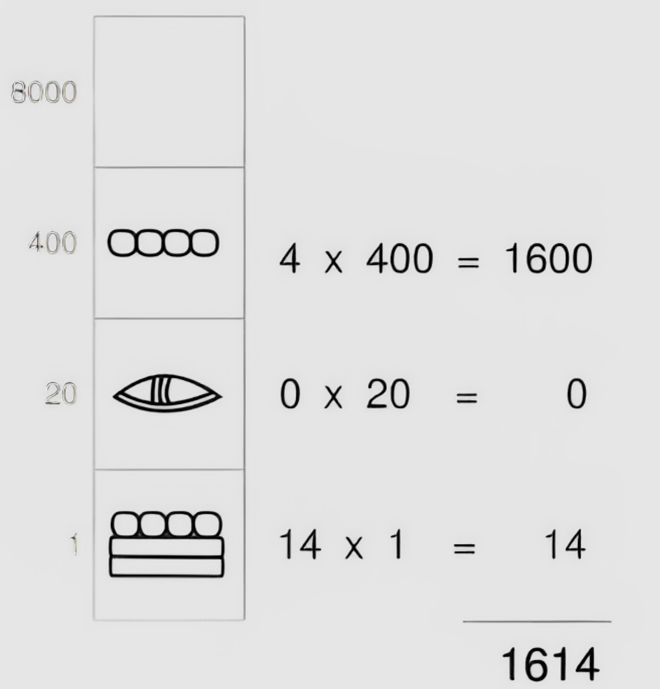

# Session 1 — `+1` : représenter le progrès

> **Durée : 3h30, pause comprise.**
>
> **Objectif :** retrouver un contenu invisible avec l'inspecteur, comprendre qu'une valeur et sa représentation sont deux choses différentes, décoder le binaire et les couleurs CSS hexadécimales, puis traduire `+1 minute` en JavaScript.

[Atelier : du binaire à l'horloge](./exercices/session_01.md) · [Programme du module](./index.md)

## Sommaire

1. **Explorer une page apparemment vide** : retrouver le contenu dans le HTML et observer les règles CSS avec l’inspecteur.
2. **Faire apparaître le texte** : explorer la console, découvrir l'affectation, puis modifier la couleur du fond.
3. **Valeurs, symboles et bases** : distinguer une quantité de son écriture, du décimal à l’hexadécimal.
4. **Représenter en binaire** : compter avec deux symboles et relier bits, octets et hexadécimal.
5. **Ajouter `1`** : comprendre l’incrémentation et les reports dans les différentes bases.

**Pause**

6. **Des variables dans la console** : représenter les heures et les minutes, lire leurs valeurs et les modifier.
7. **Faire avancer le temps** : ajouter une minute, distinguer calcul et affectation, puis rencontrer les limites des minutes et des heures.
8. **De la console aux fichiers** : conserver les instructions dans `script.js`, chargé par `index.html`.
9. **Exprimer les règles avec `if`** : gérer les reports des minutes et des heures.

## 1. Une action visible, une valeur invisible


### Une page apparemment vide

<a href="./exercices/session_01/let-there-be-light.html" target="_blank" rel="noopener noreferrer">Ouvrez le document HTML dans un nouvel onglet, en vue scindée</a>. La page paraît vide : vous ne voyez qu'une surface noire. Cela suffit-il à conclure qu'elle ne contient rien ?

Ouvrez les outils de développement avec **F12**, ou **Ctrl + Shift + i** ou click droit puis **Inspecter**, puis choisissez **Éléments** ou **Inspecteur**, selon le navigateur. Dépliez le contenu de `body`. Retrouvez le texte de Louis H. Sullivan, ses trois paragraphes et son attribution. Quels éléments HTML les structurent ?

Sélectionnez `body` et observez ses règles CSS. Repérez `color` et `background-color` : le texte est noir et le fond aussi. Gardez ces valeurs pendant l'exploration.

Le contenu est présent et lisible dans l'inspecteur, même s'il est invisible sur la page. Une erreur de CSS peut produire cette situation : l'inspecteur permet alors de retrouver le contenu et de chercher ce qui empêche de le voir.

Gardez ce document ouvert et passez à la **Console** : que peut-on lui dire ? Nous chercherons comment agir sur la page ; le texte apparaîtra à la fin de cette exploration, après l'introduction de l'opérateur d'affectation.

Chaque bloc **À saisir** correspond à un essai séparé. Validez-le avec Entrée, puis observez la réponse avant de poursuivre. Les encadrés **À observer** montrent des réponses ou des éléments à retrouver ; ne les saisissez pas.

### Quelqu'un répond ?

Commencez par un mot qui vous vient naturellement.

**À saisir**

```js
hello
```

**À observer**

> `ReferenceError: hello is not defined`

Essayons autrement.

**À saisir**

```js
salut
```

Et avec votre prénom ? Avec `hi`, `coucou` ou `me` ? Les réponses changent-elles vraiment ? Repérez ce qui reste identique et ce qui reprend le mot saisi. Vous pouvez continuer après une erreur.

Essayons une phrase.

**À saisir**

```js
is this a trap ?
```

**À observer**

> `SyntaxError: Unexpected token 'this'`

Cette fois, le message est différent. Il désigne `this`. Essayons le tout seul.

**À saisir**

```js
this
```

**À observer**

> `Window { … }`

Dans cette console, quelque chose est accessible avec `this`. Dépliez la réponse. Quels mots reconnaissez-vous ? Les valeurs affichées à côté de ces mots ont-elles toutes la même apparence ?

### Suivre les mots qui apparaissent

La réponse commence par `Window`. Essayons ce nom, avec sa majuscule.

**À saisir**

```js
Window
```

**À observer**

> `ƒ Window() { [native code] }`

Retrouvez aussi `window`, avec une minuscule, parmi les propriétés affichées.

**À saisir**

```js
window
```

Une seule lettre a changé de casse. Obtenez-vous la même réponse ?

Dans cette liste, un autre nom attire l'attention : `alert`.

**À saisir**

```js
alert
```

**À observer**

> `ƒ alert() { [native code] }`

Des parenthèses apparaissent après son nom. Essayons de les reprendre.

**À saisir**

```js
alert()
```

Une boîte apparaît-elle ? Fermez-la, puis regardez ce que répond la console.

**À observer**

> `undefined`

Cette réponse peut donc accompagner un effet visible. Essayons de placer entre les parenthèses un élément déjà rencontré.

**À saisir**

```js
alert(this)
```

Comparez ce que montre la boîte avec ce que la console montrait pour `this`. Fermez-la, puis reprenez un de vos premiers essais.

**À saisir**

```js
alert(hello)
```

Reconnaissez-vous l'erreur ? Ajouter les parenthèses a-t-il suffi à faire reconnaître `hello` ?

### Let me out

Essayons une autre phrase.

**À saisir**

```js
let me out
```

**À observer**

> `SyntaxError: Unexpected identifier 'out'`

Le message désigne `out`. Que se passe-t-il si l'on essaie chacun des trois mots séparément ?

**À saisir**

```js
let
```

**À saisir**

```js
me
```

**À saisir**

```js
out
```

Les mots seuls provoquent des erreurs. Essayons maintenant les deux premiers ensemble.

**À saisir**

```js
let me
```

**À observer**

> `undefined`

Plus d'erreur ? Revenez au mot qui était inconnu quelques instants auparavant.

**À saisir**

```js
me
```

**À observer**

> `undefined`

Avant `let me`, saisir `me` provoquait une erreur. Maintenant, la console répond `undefined`, sans erreur. Vous avez créé quelque chose : un nom que la console reconnaît désormais.

Si l'on peut créer `me`, peut-on créer de la lumière ? Essayons avec le mot anglais `light`.

**À saisir**

```js
let light
```

**À saisir**

```js
light
```

La console reconnaît-elle ce nouveau nom ? Et sur la page noire, de la lumière est-elle apparue ?

### Que dit le HTML ?

Revenez au HTML de la page dans l'inspecteur. Sa première ligne contient une indication comme celle-ci.

**À observer dans le HTML**

```html
<!DOCTYPE html>
```

Avant de revenir à la console, décomposons cette expression. Décomposer consiste
à séparer un ensemble en parties plus petites pour chercher le sens de chacune :

```text
DOC + TYPE + HTML
```

Cette manière de raisonner est l'une des mécaniques de la programmation. Face à
un nom, une instruction ou un problème, on peut le décomposer en éléments plus
simples. On peut ensuite effectuer le mouvement inverse : composer plusieurs
éléments pour construire une expression plus précise. Nous utiliserons souvent
ces deux mouvements pour lire et écrire du code.

Dans `DOCTYPE HTML`, `TYPE` désigne un type et `HTML` nomme le langage du
document. `DOC` est une abréviation courante du mot anglais *document*. En
recomposant ces éléments, on peut donc lire cette ligne comme « document de type
HTML ».

Cette décomposition nous donne un nouvel indice : le mot à chercher pourrait
être `document`. Revenons maintenant dans la console et commençons à le saisir.
Observez les propositions qui apparaissent pendant la frappe : la console
reconnaît-elle ce mot ? Lorsqu'elle propose `document`, complétez le mot, puis
validez-le.

**À saisir**

```js
document
```

La console affiche alors le document HTML tout entier. Comme dans l'inspecteur,
on y retrouve une structure en arbre : le document contient des éléments qui
peuvent eux-mêmes en contenir d'autres. Cette organisation forme plusieurs
niveaux.

Nous pouvons maintenant composer une nouvelle expression à partir de
`document`. Ajoutez un point, sans encore valider. Le point sert d'élément de
navigation : il indique que nous voulons partir de `document` pour atteindre le
niveau suivant. La console peut alors proposer les noms accessibles depuis ce
point de départ.

**À saisir**

```js
document.
```

### Où chercher la couleur ?

Vous avez déjà repéré le CSS qui rend le texte et le fond noirs. Cherchons comment atteindre la couleur du fond depuis `document`. Essayons quelques noms possibles après un point.

**À saisir**

```js
document.css
```

**À saisir**

```js
document.cascade
```

**À saisir**

```js
document.style
```

Obtenez-vous une erreur, une valeur ou quelque chose à déplier ? Retrouve-t-on la même réponse que lorsqu'on saisit un nom inconnu tout seul ?

Revenez au HTML. Sur quel élément la couleur de fond est-elle définie ? Vous y retrouvez `body`.

**À saisir**

```js
document.body
```

Saisissez ensuite le début `document.body.` et regardez les suggestions de la console avant de valider. Y trouvez-vous `style` ?

**À saisir**

```js
document.body.style
```

Continuez avec `document.body.style.`. Parcourez les suggestions. Quels noms évoquent le fond ? La couleur ? Complétez à partir de ce que la console propose.

**À saisir**

```js
document.body.style.backgroundColor
```

Comparez le nom proposé avec `background-color` en CSS. Où est passé le tiret ? Quelle lettre est devenue majuscule ?

Si la console affiche une chaîne vide, cela ne veut pas dire que le fond n'a pas de couleur : `style` donne accès aux styles en ligne de l'élément. Le noir peut provenir d'une règle CSS dans une feuille de style. Vous avez néanmoins trouvé une propriété sur laquelle agir.

### Les deux-points permettent-ils d'affecter une valeur ?

Dans la représentation de `window`, les noms et les valeurs sont séparés par `:`. Peut-on reprendre cette ponctuation pour associer une valeur à `light` ? Essayons avec deux noms déjà connus.

**À saisir**

```js
light : window
```

La console accepte cette écriture et affiche une réponse. A-t-elle pour autant changé la valeur de `light` ? Demandons-la de nouveau.

**À saisir**

```js
light
```

**À observer**

> `undefined`

Essayons dans l'autre sens.

**À saisir**

```js
window : light
```

Puis consultons `window`.

**À saisir**

```js
window
```

Il désigne toujours le même objet. Ces écritures sont acceptées, mais elles n'effectuent aucune affectation. La ponctuation vue dans la représentation d'un objet ne suffit pas à déduire comment modifier une variable.

### Les règles pour écrire ce que l'on veut faire

Pour poursuivre, donnons un nom précis à ce que nous avons rencontré et introduisons les règles nécessaires.

| Écriture rencontrée | Signification |
|---|---|
| `let light` | Déclarer une variable dont l'identifiant est `light` |
| `light` | Lire la valeur associée à cet identifiant |
| `undefined` | Une valeur JavaScript ; c'est notamment celle de `light` après sa déclaration sans valeur initiale |
| `document.body` | Accéder à la propriété `body` de l'objet `document` |
| `alert` | Consulter une fonction existante |
| `alert()` | Appeler cette fonction |
| `alert(this)` | L'appeler en lui transmettant une valeur, appelée argument |

**L'opérateur d'affectation est `=`.** Il place la valeur de l'expression de droite dans la variable ou la propriété désignée à gauche.

Pour représenter une lumière allumée ou éteinte, utilisons les valeurs booléennes **`true`** et **`false`**. La variable `light` existe déjà : affectons-lui une valeur.

**À saisir**

```js
light = true
```

**À saisir**

```js
light
```

**À observer**

> `true`

Cette fois, la lecture confirme le changement. Regardez pourtant la page : elle reste noire et le texte est toujours invisible. Le navigateur ne donne pas au nom `light` le sens de « rendre la page lumineuse ».

Dans un programme où cette variable n'existe pas encore, sa déclaration et son initialisation pourront s'écrire ensemble.

**À lire pour le futur programme**

```js
let light = true;
```

La déclaration crée la variable ; l'initialisation lui donne sa première valeur. Le point-virgule termine ici l'instruction.

### Affecter une couleur à la surface

Nous connaissons maintenant la propriété à atteindre et l'opérateur d'affectation. Il reste à écrire la valeur de couleur dans le langage JavaScript.

Le code CSS `#fff` doit être transmis comme du **texte**, appelé une **chaîne de caractères**. En JavaScript, les guillemets permettent de délimiter ce texte : `"#fff"`. Ils ne font pas partie du code de couleur transmis au CSS.

**À saisir**

```js
document.body.style.backgroundColor = "#fff"
```

Le fond devient blanc et le texte noir de Louis H. Sullivan apparaît. Retrouvez les paragraphes et l'attribution observés dans l'inspecteur. Cette instruction a changé la couleur du fond : elle n'a ajouté aucun contenu au document.

Essayons maintenant d'éteindre la lumière.

**À saisir**

```js
light = false
```

**À saisir**

```js
light
```

La valeur est `false`. Le fond est-il redevenu noir ? Le texte a-t-il disparu ? Il reste visible : modifier la variable ne change pas automatiquement la présentation.

Vous pouvez modifier l'état conservé dans `light`. Vous pouvez modifier la couleur du `body`. Pour l'instant, ces deux changements sont indépendants.

### Comparer pour pouvoir décider

Pour choisir une couleur en fonction de l'état, le programme devra poser une question sur la valeur de `light`.

**L'opérateur `===` compare deux valeurs.** Il produit `true` si elles sont strictement égales, et `false` sinon. Il n'effectue aucune affectation.

**À saisir**

```js
light === true
```

**À observer**

> `false`

**À saisir**

```js
light === false
```

**À observer**

> `true`

La réponse change selon la question. La valeur conservée dans la variable a-t-elle changé ?

**À saisir**

```js
light
```

Pour le premier exercice, « Let there be light », utilisez cette convention :

| Valeur de `light` | Couleur du fond | Texte noir |
|---|---|---|
| `true` | Blanc : `#fff` | Visible |
| `false` | Noir : `#000` | Invisible, toujours présent dans le document |

Vous savez conserver un état, le comparer et agir sur la surface. Il reste à écrire la règle qui les relie. Cette correspondance est votre choix : JavaScript n'associe automatiquement ni `true` au blanc, ni `false` au noir.

## 2. Représenter n'est pas être

Le dessin d'une pipe n'est pas une pipe. De la même manière, le dessin d'un nombre n'est pas la quantité elle-même.

Une quantité de treize objets peut notamment être représentée par :

- treize marques : `|||||||||||||` ;
- le nombre décimal `13` ;
- le nombre binaire `1101` ;
- le nombre hexadécimal `D`.

Ces écritures ne deviennent lisibles que lorsqu'un groupe partage leurs conventions.

### Une convention inconnue

Montrer d'abord l'image sans explication :


Demander : « Quelle valeur voyez-vous ? Qu'est-ce qui vous manque pour la lire ? »

<details>
  <summary><strong>Révéler les positions et la valeur</strong></summary>
  
</details>

L'objectif n'est pas d'apprendre la numération maya. L'image rend visible le besoin d'un système partagé.

## 3. Systèmes de numération

Un système de numération définit des symboles et des règles permettant d'écrire des valeurs.

Dans un système positionnel, la valeur d'un symbole dépend :

- du symbole lui-même ;
- de sa position ;
- de la base utilisée.

### Base 10

Le système décimal utilise dix chiffres : `0 1 2 3 4 5 6 7 8 9`.

```text
847 = 800 + 40 + 7
847 = 8 × 100 + 4 × 10 + 7 × 1
847 = 8 × 10² + 4 × 10¹ + 7 × 10⁰
```

| Position | `10²` | `10¹` | `10⁰` |
|---|---:|---:|---:|
| Poids | 100 | 10 | 1 |
| Chiffre | 8 | 4 | 7 |

Le zéro ne signifie pas seulement « rien ». Dans `1023`, il maintient la position des centaines et indique qu'il y en a zéro.

### Ce que fait réellement `+1`

Dans une représentation ordonnée, `+1` demande de passer à la valeur suivante.

```text
8 + 1 = 9
9 + 1 = 10
```

Lorsque les symboles disponibles sont épuisés à une position, cette position revient à zéro et le changement se propage à la position voisine. C'est le report.

## 4. Binaire : deux symboles, les mêmes principes

Le système binaire utilise `0` et `1`. Un bit est une position binaire. Huit bits permettent de représenter les valeurs entières de 0 à 255.

| Position | `2⁷` | `2⁶` | `2⁵` | `2⁴` | `2³` | `2²` | `2¹` | `2⁰` |
|---|---:|---:|---:|---:|---:|---:|---:|---:|
| Poids | 128 | 64 | 32 | 16 | 8 | 4 | 2 | 1 |
| Bit | 1 | 1 | 0 | 0 | 1 | 1 | 0 | 0 |

```text
11001100₂
= 1×128 + 1×64 + 0×32 + 0×16 + 1×8 + 1×4 + 0×2 + 0×1
= 204₁₀
```

Le report apparaît clairement quand une position ne peut contenir que zéro ou un :

```text
00001111 + 1 = 00010000
```

## 5. Hexadécimal : la représentation des couleurs CSS

Le système hexadécimal utilise seize symboles :

```text
0 1 2 3 4 5 6 7 8 9 A B C D E F
```

Les lettres représentent les valeurs décimales 10 à 15. Deux chiffres hexadécimaux couvrent `00–FF`, soit `0–255`.

Une couleur CSS sur huit chiffres suit la convention `#RRGGBBAA` :

| Paire | Signification | Intervalle décimal |
|---|---|---:|
| `RR` | Rouge | 0–255 |
| `GG` | Vert | 0–255 |
| `BB` | Bleu | 0–255 |
| `AA` | Alpha, ou opacité | 0–255 |

Décomposons `#336699CC` :

```text
33₁₆ = 3×16 + 3 = 51
66₁₆ = 6×16 + 6 = 102
99₁₆ = 9×16 + 9 = 153
CC₁₆ = 12×16 + 12 = 204
```

La couleur contient donc les canaux RGB `(51, 102, 153)`. Son alpha vaut `204 / 255 = 0,8`, soit 80 %.

```css
color: #336699CC;
color: rgba(51, 102, 153, 0.8);
```

Le même nombre peut maintenant être lu dans trois systèmes :

```text
11001100₂ = 204₁₀ = CC₁₆
```

## 6. Une horloge est aussi une représentation

`13:59` n'est pas le temps lui-même. C'est une écriture conventionnelle composée de deux champs séparés par `:`.

- les minutes sont valides de 0 à 59 ;
- les heures sont valides de 0 à 23 ;
- ajouter une minute peut provoquer un report vers les heures.

Pour cette nouvelle manipulation, ouvrez un nouvel onglet à l'adresse `about:blank`, puis sa console. Gardez le document de Sullivan dans son onglet. Commencez par :

```js
let hours = 13;
let minutes = 37;

document.write(hours + ":" + minutes);
```

Puis modifier la valeur et écrire une seconde fois :

```js
minutes = minutes + 1;
document.write(hours + ":" + minutes);
```

La page contient maintenant deux représentations. La valeur a évolué, mais nous n'avons pas demandé au navigateur de remplacer l'affichage précédent.

Avant la pause, recueillir les problèmes découverts :

- Comment n'afficher qu'une seule heure ?
- Comment faire avancer l'horloge sans répéter manuellement le code ?
- Comment la relier à l'heure réelle ?
- Que devient `59 + 1` dans le champ des minutes ?
- Pourquoi écrit-on habituellement `14:00` plutôt que `14:0` ?

La seconde moitié résout uniquement le report et produit une seule sortie finale. Les autres problèmes restent visibles pour la suite.

## 7. Après la pause : un programme dans deux fichiers

Jusqu'ici, les instructions ont été saisies directement dans la console. Créer un fichier `script.js` permet d'introduire la **séparation des responsabilités** (*Separation of Concerns*, ou SoC).

| Langage | Responsabilité | Dans notre horloge |
|---|---|---|
| **HTML** | Décrire les éléments et la structure du document | Fournir la page qui charge le programme |
| **CSS** | Définir la présentation des éléments | Pourrait régler la typographie, les couleurs et la disposition |
| **JavaScript** | Représenter l'état, appliquer les règles et provoquer les changements | Conserver les heures et les minutes, effectuer `+1` et écrire le résultat |

Séparer ces responsabilités évite de mélanger structure, apparence et comportement dans un même fichier. Cette première horloge n'a pas encore besoin de règle CSS : nous créons donc `index.html` et `script.js`, tout en situant clairement le rôle du troisième langage.

Le document HTML charge le programme :

```html
<!DOCTYPE html>
<html lang="fr">
<head>
  <meta charset="UTF-8">
  <meta name="viewport" content="width=device-width, initial-scale=1.0">
  <title>+1 minute</title>
  <script src="script.js" defer></script>
</head>
<body></body>
</html>
```

Le fichier `script.js` contient d'abord deux valeurs valides, puis l'opération :

```js
let hours = 13;
let minutes = 37;

minutes = minutes + 1;
```

### Le report des minutes

```js
if (minutes === 60) {
  minutes = 0;
  hours = hours + 1;
}
```

`===` compare deux valeurs. Le bloc est exécuté uniquement lorsque la comparaison est vraie.

### Le report des heures

La valeur `24` ne peut apparaître qu'au moment où les minutes provoquent un report. La seconde condition se place donc dans la première :

```js
let hours = 23;
let minutes = 59;

minutes = minutes + 1;

if (minutes === 60) {
  minutes = 0;
  hours = hours + 1;

  if (hours === 24) {
    hours = 0;
  }
}

document.write(hours + ":" + minutes);
```

Le programme avance d'une minute par chargement. Il ne tourne pas automatiquement et ne connaît pas l'heure réelle.

### Point de contrôle

L'étudiant doit pouvoir :

1. retrouver un contenu invisible avec l'inspecteur et expliquer le rôle des couleurs du texte et du fond ;
2. distinguer une valeur de sa représentation ;
3. décoder un octet binaire en décimal ;
4. décoder les quatre paires de `#RRGGBBAA` ;
5. expliquer pourquoi `let light = true` ne change pas la page, alors qu'affecter du blanc au fond révèle le texte déjà présent ;
6. distinguer `minutes + 1` de `minutes = minutes + 1` ;
7. prédire les résultats de `13:37`, `13:59` et `23:59`.

## 8. Terminer par ce que `+1` devient

Montrer les résultats finaux des séances à venir, sans demander aux étudiants de construire Pixelator aujourd'hui :

1. quatre pixels qui changent d'état au clic ;
2. une couleur choisie et un état réversible ;
3. une grille générée par répétition ;
4. des fonctions qui organisent les comportements ;
5. un geste de peinture qui dure dans le temps ;
6. un dessin représenté par des données puis sauvegardé ;
7. une collection dans laquelle on crée, lit, modifie et supprime ;
8. une interface qui réutilise les mêmes règles ;
9. une galerie alimentée par une API ;
10. un portfolio ou un écran de commandes alimenté par ses propres données.

Finir avec la chaîne :

```text
action humaine → +1 → état mémorisé → compteur visible → progrès interprété
```

Un like n'est pas `+1`. Une vue n'est pas `+1`. La plateforme choisit de représenter ces événements par `+1`, puis de rendre leur accumulation visible.

Le nombre est une représentation. La variable est une représentation. L'horloge est une représentation. Le compteur aussi.
